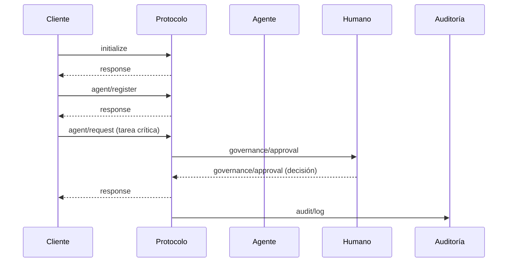
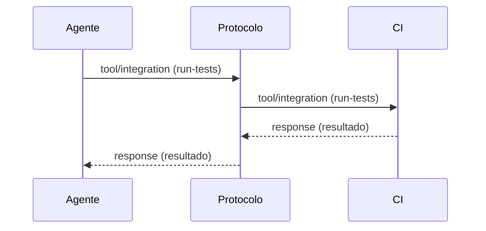
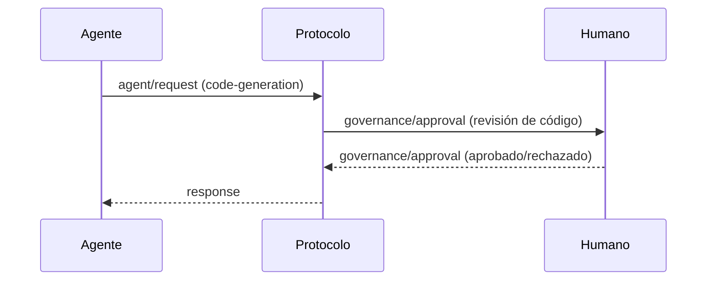
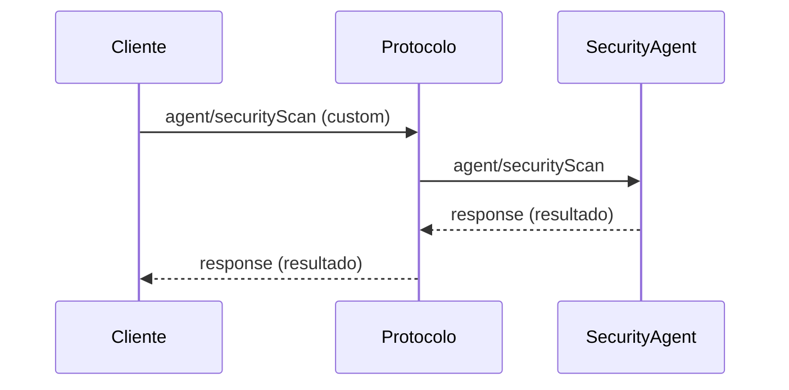

# 10. Ejemplos de Uso y Casos Prácticos - Especificación HugAI v2

Esta sección presenta ejemplos completos y casos prácticos de uso del protocolo HugAI v2, con mensajes JSON y diagramas de secuencia.

---

## 10.1. Ciclo Completo: Inicialización, Registro, Solicitud, Aprobación y Auditoría

**Flujo:** Un agente se inicializa, se registra, solicita una tarea que requiere aprobación humana, y todo queda auditado.



**Mensajes JSON:**
- `initialize`, `agent/register`, `agent/request`, `governance/approval`, `response`, `audit/log`

---

## 10.2. Integración con Herramienta Externa (CI/CD)

**Flujo:** Un agente solicita ejecutar pruebas en una herramienta CI/CD y recibe el resultado.



**Mensaje de solicitud:**
```json
{
  "jsonrpc": "2.0",
  "method": "tool/integration",
  "params": {
    "tool": "ci-pipeline",
    "action": "run-tests",
    "data": { "branch": "main" }
  },
  "id": 20
}
```

---

## 10.3. Caso de Gobernanza Humana

**Flujo:** Un agente genera código, pero requiere revisión y aprobación humana antes de integrarlo.



**Mensaje de aprobación:**
```json
{
  "jsonrpc": "2.0",
  "method": "governance/approval",
  "params": {
    "checkpoint": "code-review",
    "artifact": { "file": "main.ts", "diff": "..." },
    "approver": "user-123",
    "decision": "approved",
    "feedback": "Cumple con los estándares."
  },
  "id": 21
}
```

---

## 10.4. Ejemplo de Extensión/Customización

**Flujo:** Un agente especializado realiza un análisis de seguridad usando un mensaje custom.



**Mensaje custom:**
```json
{
  "jsonrpc": "2.0",
  "method": "agent/securityScan",
  "params": {
    "target": "main.ts",
    "level": "deep"
  },
  "id": 22
}
```

---

> **Nota:** Estos ejemplos pueden adaptarse y ampliarse según los escenarios de uso y la evolución del protocolo. 