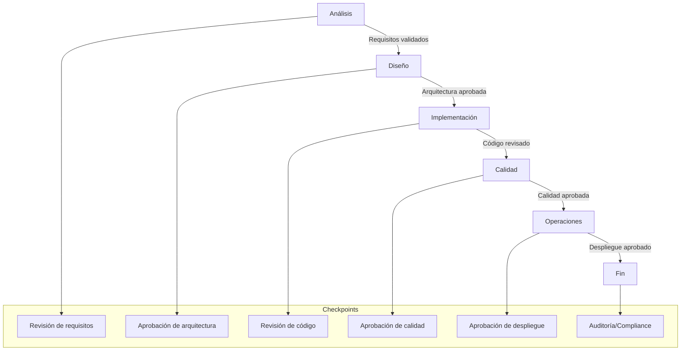
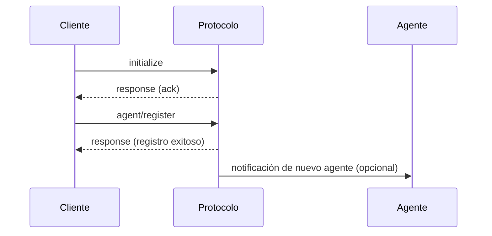
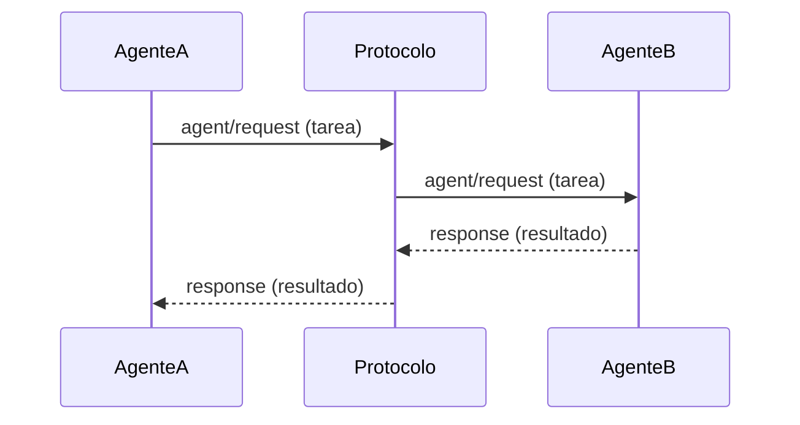
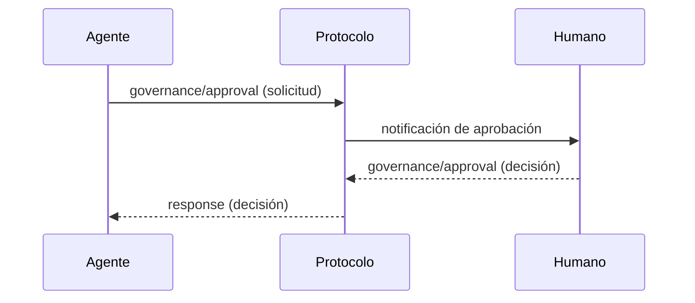
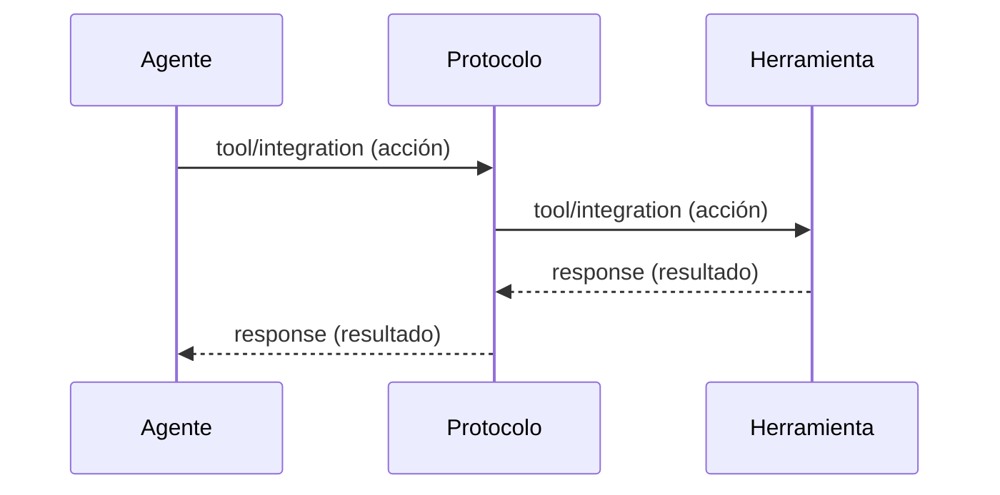

# 4. Flujos de Comunicación y Secuencias - Especificación HugAI v2

Esta sección describe los principales flujos de comunicación entre agentes, humanos y herramientas en el protocolo HugAI v2, usando diagramas de secuencia y ejemplos.

---

## 4.0. Tabla de Fases, Agentes y Checkpoints

| Fase                | Agentes Principales                        | Checkpoints de Gobernanza                | Descripción breve                                      |
|---------------------|--------------------------------------------|------------------------------------------|--------------------------------------------------------|
| **Análisis**        | Requirements Analyzer, Domain Expert       | Revisión de requisitos                   | Extracción y validación de requisitos, contexto         |
| **Diseño**          | Architecture Agent, Router Agent           | Aprobación de arquitectura               | Diseño de arquitectura, modelos y APIs                  |
| **Implementación**  | Code Generator, Integration Agent, Documentation Writer | Revisión de código, documentación        | Generación de código, integración, documentación        |
| **Calidad**         | Test Agent, Security Agent, Performance Agent, Code Reviewer | Aprobación de calidad, seguridad         | Testing, análisis de seguridad, performance, revisión   |
| **Operaciones**     | Deployment Agent, DevOps Agent, Maintenance Agent, Observability Agent | Aprobación de despliegue, monitoreo      | Despliegue, CI/CD, monitoreo, mantenimiento            |
| **Gobernanza**      | Compliance Agent, Risk Management Agent, Escalation Manager | Auditoría, compliance, gestión de riesgos| Supervisión, cumplimiento, gestión de incidencias       |

---

## 4.0.1. Diagrama de Fases, Agentes y Checkpoints



---

## 4.0.2. Explicación de Fases y Colaboración

- **Análisis:** Los agentes de análisis extraen y validan requisitos, con revisión humana si es necesario.
- **Diseño:** Los agentes de diseño proponen arquitecturas y modelos, sujetos a aprobación de stakeholders.
- **Implementación:** Los agentes de implementación generan código y documentación, revisados por agentes de calidad y humanos.
- **Calidad:** Los agentes de calidad ejecutan tests, análisis de seguridad y performance, con checkpoints de aprobación.
- **Operaciones:** Los agentes de operaciones despliegan, monitorizan y mantienen el sistema, con aprobaciones para despliegues críticos.
- **Gobernanza:** Los agentes de gobernanza supervisan compliance, riesgos y gestionan incidencias, con auditoría y checkpoints finales.

---

## 4.1. Inicialización y Registro de Agente

**Descripción:** Un cliente o agente inicia la conexión, negocia capacidades y se registra en el sistema.



**Ejemplo de mensajes:**
- `initialize`
- `agent/register`
- `response`

---

## 4.2. Solicitud y Respuesta de Tarea entre Agentes

**Descripción:** Un agente solicita a otro la ejecución de una tarea y recibe la respuesta.



**Ejemplo de mensajes:**
- `agent/request`
- `response`

---

## 4.3. Flujo de Gobernanza y Aprobación Humana

**Descripción:** Un agente o el sistema solicita aprobación humana para un artefacto o decisión crítica.



**Ejemplo de mensajes:**
- `governance/approval`
- `response`

---

## 4.4. Integración de Herramientas Externas

**Descripción:** Un agente interactúa con una herramienta externa (CI/CD, análisis, etc.) a través del protocolo.



**Ejemplo de mensajes:**
- `tool/integration`
- `response`

---

## 4.5. Auditoría y Trazabilidad

**Descripción:** Todas las acciones relevantes se registran para trazabilidad y cumplimiento.

```mermaid
sequenceDiagram
    participant Actor
    participant Protocolo
    participant Auditoría
    Actor->>Protocolo: acción relevante (cualquier mensaje)
    Protocolo->>Auditoría: audit/log
    Auditoría-->>Protocolo: response (ack)
```

**Ejemplo de mensajes:**
- `audit/log`
- `response`

---

> **Nota:** Estos flujos pueden combinarse y extenderse según la complejidad del sistema y los escenarios de uso. 