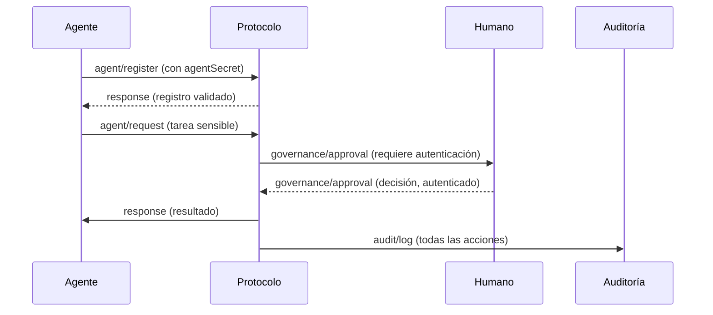

# 9. Seguridad y Validación - Especificación HugAI v2

Esta sección describe los principios y mecanismos de seguridad y validación en el protocolo HugAI v2.

---

## 9.1. Principios de Seguridad

- Seguridad por diseño: todos los mensajes y flujos consideran amenazas y protección de datos.
- Mínimos privilegios: los agentes y humanos solo acceden a lo necesario.
- Trazabilidad y auditoría de todas las acciones relevantes.

---

## 9.2. Autenticación y Autorización

- **Agentes:**
  - Cada agente debe tener un `agentId` único y, opcionalmente, un `agentSecret` o token para autenticación.
  - El sistema valida la identidad antes de aceptar registros o solicitudes sensibles.
- **Humanos:**
  - Los aprobadores y usuarios deben autenticarse (por ejemplo, SSO, OAuth, etc.).
  - Los roles y permisos determinan qué acciones pueden aprobar o ejecutar.

---

## 9.3. Validación de Mensajes y Datos

- Todos los mensajes deben validarse contra su esquema antes de ser procesados.
- Los campos requeridos y tipos deben comprobarse rigurosamente.
- Los agentes deben rechazar mensajes malformados o inesperados.

---

## 9.4. Auditoría y Trazabilidad

- Todas las acciones críticas (aprobaciones, cambios, ejecuciones) deben registrarse mediante `audit/log`.
- Los registros deben incluir: actor, acción, timestamp, detalles y resultado.
- Se recomienda almacenar logs de auditoría en sistemas inmutables o protegidos.

---

## 9.5. Buenas Prácticas de Protección y Prevención

- Nunca exponer secretos (agentSecret, tokens) en logs o mensajes.
- Usar canales cifrados (TLS/SSL) para todas las comunicaciones.
- Rotar credenciales y tokens periódicamente.
- Limitar el alcance de los tokens y permisos.
- Implementar mecanismos de rate limiting y detección de anomalías.
- Validar entradas para prevenir inyección, XSS, y otros ataques comunes.

---

## 9.6. Ejemplo de Flujo Seguro

---

> **Nota:** La seguridad es responsabilidad compartida entre agentes, humanos y el sistema. Se recomienda revisar y actualizar las políticas de seguridad periódicamente. 