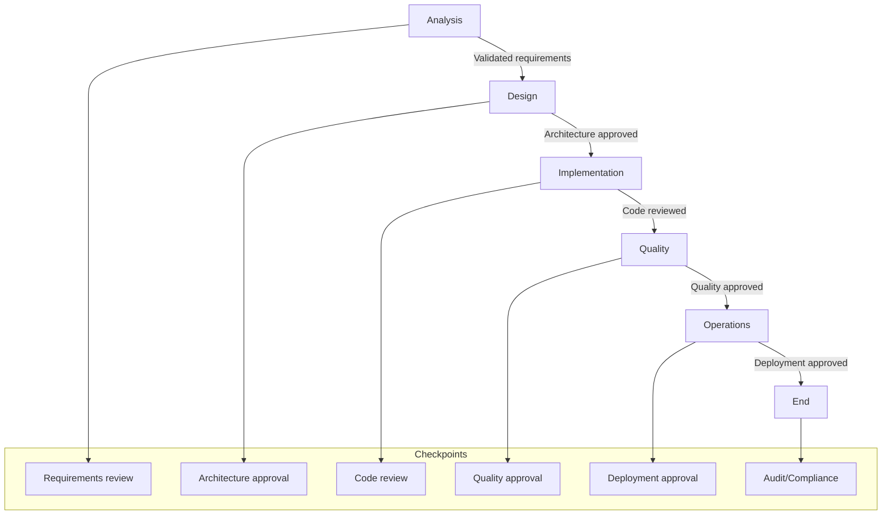
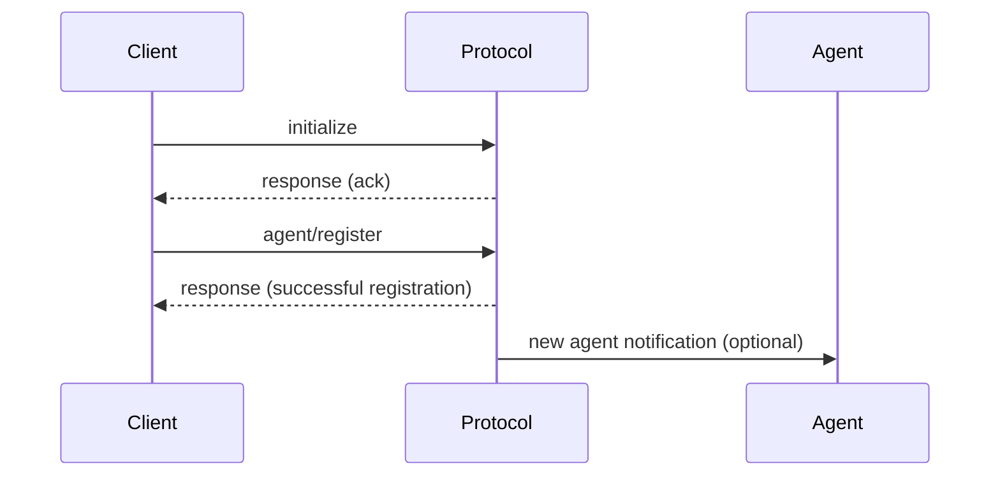
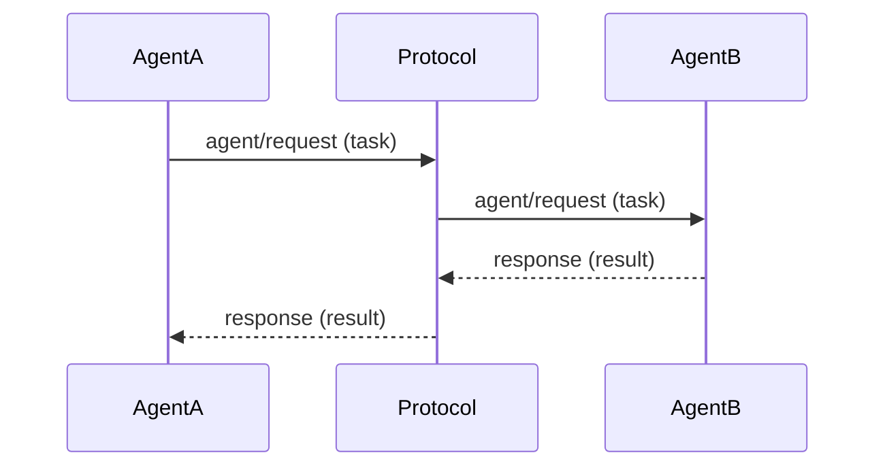
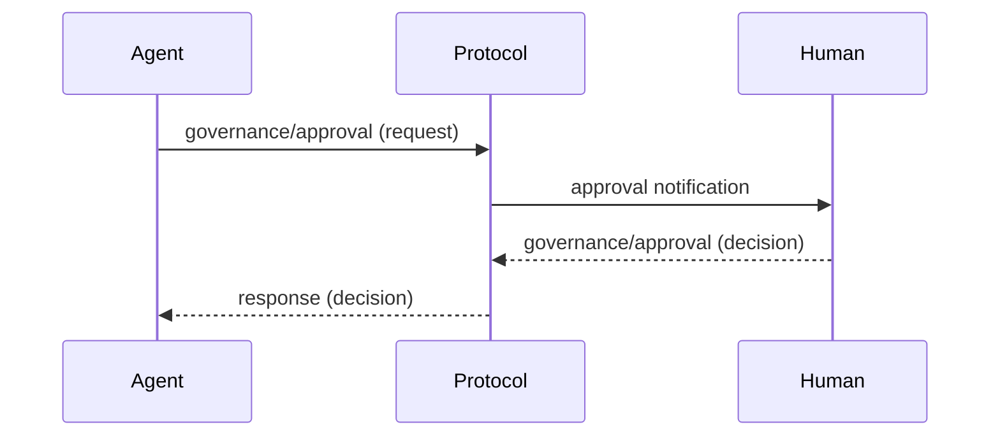
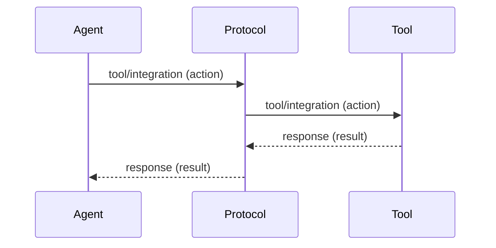

# 4. Communication Flows and Sequences - HugAI v2 Specification

This section describes the main communication flows between agents, humans, and tools in the HugAI v2 protocol, using sequence diagrams and examples.

---

## 4.0. Table of Phases, Agents, and Checkpoints

| Phase               | Main Agents                                 | Governance Checkpoints                   | Brief Description                                      |
|---------------------|---------------------------------------------|------------------------------------------|--------------------------------------------------------|
| **Analysis**        | Requirements Analyzer, Domain Expert        | Requirements Review                      | Extraction and validation of requirements, context     |
| **Design**          | Architecture Agent, Router Agent            | Architecture Approval                    | Architecture, models, and API design                   |
| **Implementation**  | Code Generator, Integration Agent, Documentation Writer | Code and documentation review            | Code generation, integration, documentation            |
| **Quality**         | Test Agent, Security Agent, Performance Agent, Code Reviewer | Quality and security approval            | Testing, security analysis, performance, review        |
| **Operations**      | Deployment Agent, DevOps Agent, Maintenance Agent, Observability Agent | Deployment approval, monitoring          | Deployment, CI/CD, monitoring, maintenance             |
| **Governance**      | Compliance Agent, Risk Management Agent, Escalation Manager | Audit, compliance, risk management       | Supervision, compliance, incident management           |

---

## 4.0.1. Phases, Agents, and Checkpoints Diagram



---

## 4.0.2. Explanation of Phases and Collaboration

- **Analysis:** Analysis agents extract and validate requirements, with human review if needed.
- **Design:** Design agents propose architectures and models, subject to stakeholder approval.
- **Implementation:** Implementation agents generate code and documentation, reviewed by quality agents and humans.
- **Quality:** Quality agents run tests, security and performance analysis, with approval checkpoints.
- **Operations:** Operations agents deploy, monitor, and maintain the system, with approvals for critical deployments.
- **Governance:** Governance agents oversee compliance, risks, and manage incidents, with audit and final checkpoints.

---

## 4.1. Agent Initialization and Registration

**Description:** A client or agent initiates the connection, negotiates capabilities, and registers in the system.



**Example messages:**
- `initialize`
- `agent/register`
- `response`

---

## 4.2. Task Request and Response Between Agents

**Description:** An agent requests another to execute a task and receives the response.



**Example messages:**
- `agent/request`
- `response`

---

## 4.3. Governance Flow and Human Approval

**Description:** An agent or the system requests human approval for an artifact or critical decision.



**Example messages:**
- `governance/approval`
- `response`

---

## 4.4. External Tool Integration

**Description:** An agent interacts with an external tool (CI/CD, analysis, etc.) through the protocol.



**Example messages:**
- `tool/integration`
- `response`

---

## 4.5. Auditing and Traceability

**Description:** All relevant actions are logged for traceability and compliance.

```mermaid
sequenceDiagram
    participant Actor
    participant Protocol
    participant Audit
    Actor->>Protocol: relevant action (any message)
    Protocol->>Audit: audit/log
    Audit-->>Protocol: response (ack)
```

**Example messages:**
- `audit/log`
- `response`

---

> **Note:** These flows can be combined and extended depending on the system's complexity and use cases.