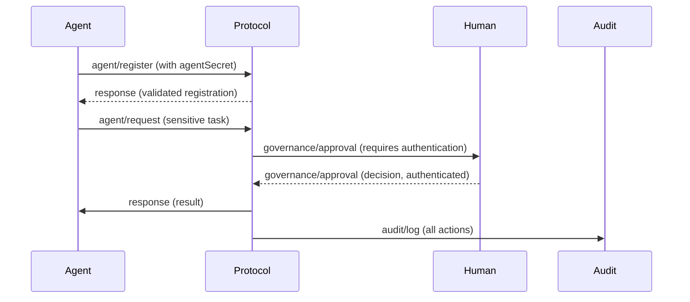

# 9. Security and Validation - HugAI v2 Specification

This section describes the security and validation principles and mechanisms in the HugAI v2 protocol.

---

## 9.1. Security Principles

- Security by design: all messages and flows consider threats and data protection.
- Least privilege: agents and humans only access what is necessary.
- Traceability and auditing of all relevant actions.

---

## 9.2. Authentication and Authorization

- **Agents:**
  - Each agent must have a unique `agentId` and, optionally, an `agentSecret` or token for authentication.
  - The system validates identity before accepting registrations or sensitive requests.
- **Humans:**
  - Approvers and users must authenticate (e.g., SSO, OAuth, etc.).
  - Roles and permissions determine which actions they can approve or execute.

---

## 9.3. Message and Data Validation

- All messages must be validated against their schema before being processed.
- Required fields and types must be rigorously checked.
- Agents must reject malformed or unexpected messages.

---

## 9.4. Auditing and Traceability

- All critical actions (approvals, changes, executions) must be logged via `audit/log`.
- Logs must include: actor, action, timestamp, details, and result.
- It is recommended to store audit logs in immutable or protected systems.

---

## 9.5. Best Practices for Protection and Prevention

- Never expose secrets (agentSecret, tokens) in logs or messages.
- Use encrypted channels (TLS/SSL) for all communications.
- Rotate credentials and tokens periodically.
- Limit the scope of tokens and permissions.
- Implement rate limiting and anomaly detection mechanisms.
- Validate inputs to prevent injection, XSS, and other common attacks.

---

## 9.6. Example of a Secure Flow

---

> **Note:** Security is a shared responsibility between agents, humans, and the system. It is recommended to review and update security policies periodically.