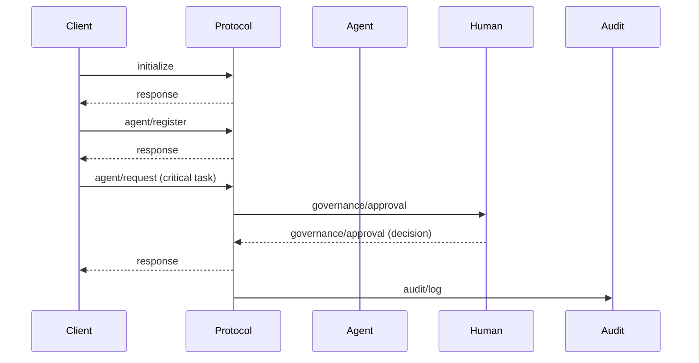
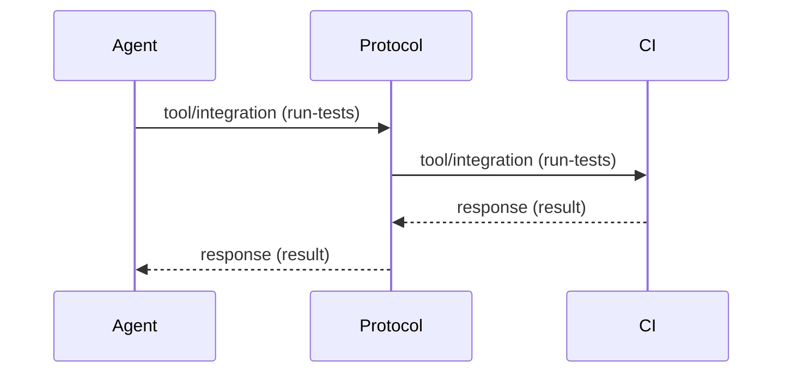
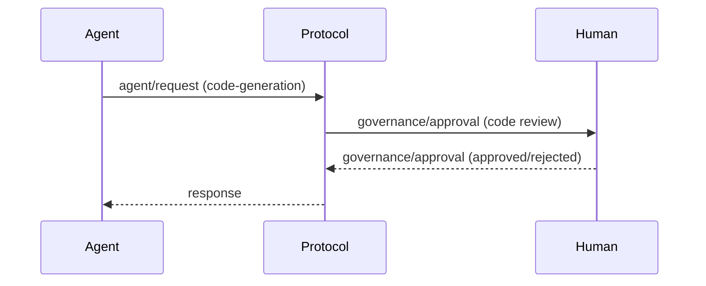
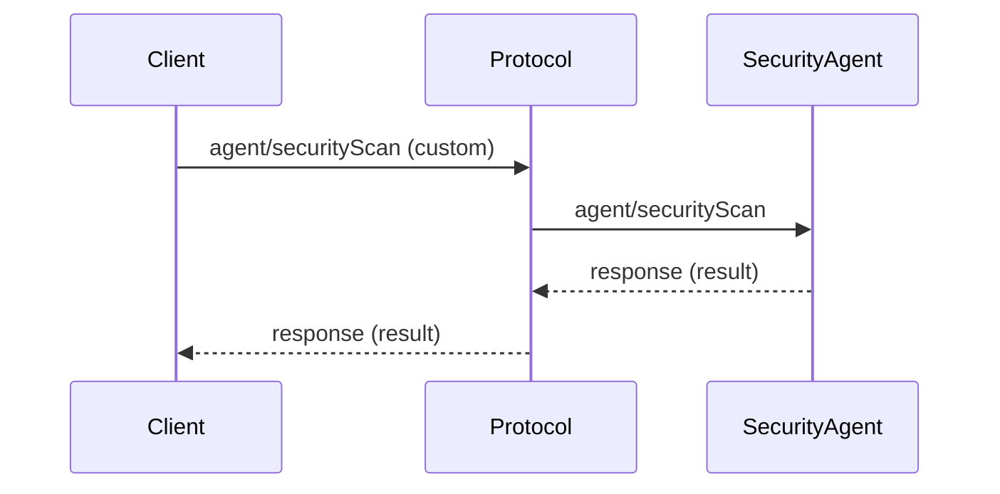

# 10. Usage Examples and Practical Cases - HugAI v2 Specification

This section presents complete examples and practical use cases of the HugAI v2 protocol, with JSON messages and sequence diagrams.

---

## 10.1. Complete Cycle: Initialization, Registration, Request, Approval, and Audit

**Flow:** An agent is initialized, registered, requests a task that requires human approval, and everything is audited.



**JSON Messages:**
- `initialize`, `agent/register`, `agent/request`, `governance/approval`, `response`, `audit/log`

---

## 10.2. Integration with External Tool (CI/CD)

**Flow:** An agent requests to run tests on a CI/CD tool and receives the result.



**Request message:**
```json
{
  "jsonrpc": "2.0",
  "method": "tool/integration",
  "params": {
    "tool": "ci-pipeline",
    "action": "run-tests",
    "data": { "branch": "main" }
  },
  "id": 20
}
```

---

## 10.3. Human Governance Case

**Flow:** An agent generates code, but requires human review and approval before integration.



**Approval message:**
```json
{
  "jsonrpc": "2.0",
  "method": "governance/approval",
  "params": {
    "checkpoint": "code-review",
    "artifact": { "file": "main.ts", "diff": "..." },
    "approver": "user-123",
    "decision": "approved",
    "feedback": "Meets the standards."
  },
  "id": 21
}
```

---

## 10.4. Extension/Customization Example

**Flow:** A specialized agent performs a security analysis using a custom message.



**Custom message:**
```json
{
  "jsonrpc": "2.0",
  "method": "agent/securityScan",
  "params": {
    "target": "main.ts",
    "level": "deep"
  },
  "id": 22
}
```

---

> **Note:** These examples can be adapted and expanded according to use scenarios and protocol evolution.